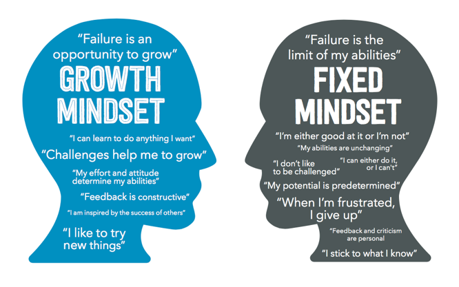

## Big O Notation

Big O describes the performance or complexity if an algorithm. The Big O describes the worst-case scenario in terms of execution time required or the space used (e.g. in memory or on disk) by an algorithm (Bell,2009)


____________
References:
A beginner's guide to Big O Notation by Rob Bell. https://rob-bell.net/2009/06/a-beginners-guide-to-big-o-notation

* O(1) describes an algorithm that will always execute in the same time (or space) regardless of the size of the input data set.
```java
bool IsFirstElementNull(IList<String> elements)
{
    return elements[0] == null;
}
```
* O(N) describes an algorithm whose performance will grow linearly and in direct proportion to the size of the input data set.
```java
  bool ContainsValue(IEnumerable<string> elements, string value)
{
    foreach (var element in elements)
    {
        if (element == value) return true; 
    }     
    return false; 
}

```

Other Big Os:
* O(N²) represents an algorithm whose performance is directly proportional to the square of the size of the input data set. 

* O(2^N) denotes an algorithm whose growth doubles with each addition to the input data set. 

___
Terms to Know:
* Binary Search

## Things I want to know more about
* OS module

___________
# Linked Lists

No linear. Controls by the data structue called 
 Similar to arrays but in biq O of 1 (the same amount of time).
## Growth Mindset

The growth mindset is the underlying beliefs people have about learning and intelligence.


You can have either a fixed, mixed or growth mindset. Here's a great graphic depicting the difference between a fixed mindset and a growth mindset Ranadive (2016):

Fixed v. Growth Mindset



The main difference that stands out to me is that a person with a growth mindset will seek to thrive in the face of challenges. 
The person with a fixed mindset on the other hand wll avoid challenges and gives up easily.