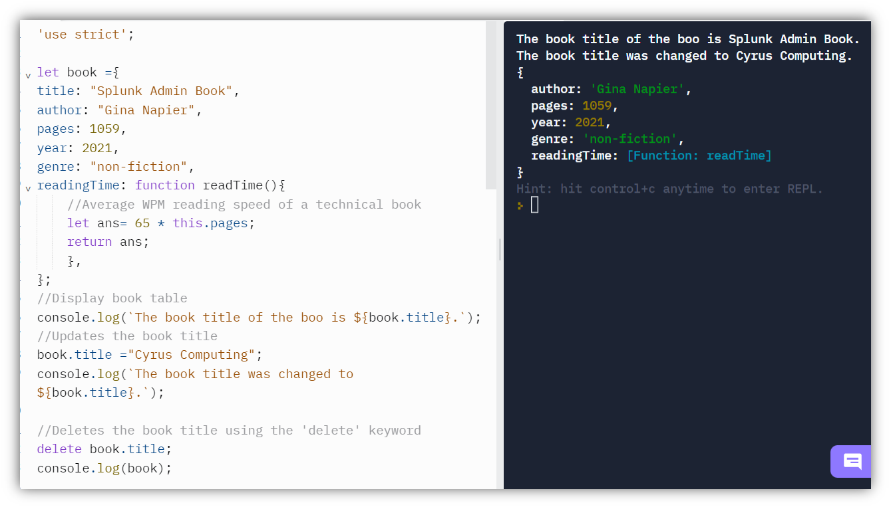

# Read: 06 - JS Object Literals; The DOM

## Understanding the Problem
Understanding the problem domain is a critical piece of the equation (Sonmez, 2013).

To understand the problem domain, you need to know all the possible use cases and function a ppiece of software or code should be able to achieve to meets its requirements. Problem domains should be clear and specific enough to allow the assignments of an accurate LOE (level of effort). A complete understanding of the problem can save you hours of work in coding. The more understanding you have about the problem, the easier it will be to come up with the solution.

## The Difference Between Primitive Values and Object references

Data types such as string, number, boolean null and so forth are assigned either primitave values or object references. Let's loowk at how both can be used to assigned a value to a variable

```js
let answer = 20;
```
In the example above, the let keyword is used to assign the priitive number value of 20 to the variable called answer.

```js
const letters ={
    a: 20,
    b: 31,
    c: 45,
}
//Assigns the referenced object property of "a" in the letters variable to a new variable cllade "answer" using dot notation
let answer = letters.a;

```
In the example above the variable named "answer" is assigned a value using an object reference.

## Object Literals

Object references are contained in objects. In other words, objects are used to group together a set of properties and functions to create a model. In JavaScript, an object a is a comma-separated list of key-value pairs wrapped in curly braces.
You can think of an object as a type of thing. For example, all books are objects. However, the title, number of pages, number of authors, and genre vary from book to book, but the are the same type of references. View the image below for a visual example of an object created using literal notation.




### Object Constructors

Another way to create an object is by using the constructor notation. The constructor notation uses a constructor function to create a new object using predefined properties contained within the constructor. Using the constructor notation is a quicker way to create an object since you only need to pass in values you want to be used in the constructor. Here's a visual example of how constructor notations work to define an object.


## The DOM (Document Object Model)

The DOM, also known as the Document Object Model dictate to browsers what HTML content to show. It also allows you to use JavaScript to update html content on your webpage. The DOM is made up of a DOM tree which holds objects that are loaded into the browser window. It is essentially the interface in which we humans use to interact with backend data. here is a visual example of the DOM, complements of W3 Scools (2022):


References:
* Duckett, J., Ruppert, G., & Moore, J. (2015). JavaScript & jQuery: Interactive Front-end web development. Wiley.
* Somez, J. (2013). Understanding The Problem Domain Is The Hardest Part Of Programming. Retrieved from: https://simpleprogrammer.com/understanding-the-problem-domain-is-the-hardest-part-of-programming
* W3 Schools (2022). The HTML DOM (Document Object Model). Retrieved from: https://www.w3schools.com/js/js_htmldom.asp
